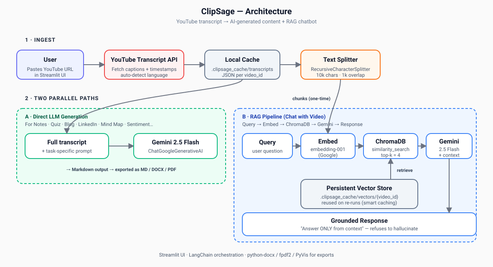

# ClipSage 🎬

> **One YouTube link in. Notes, quizzes, blog posts, a mind map, and a grounded RAG chatbot out.**

[](https://www.python.org/)
[](https://streamlit.io/)
[](https://www.langchain.com/)
[](https://ai.google.dev/)
[](https://www.trychroma.com/)


ClipSage is an end-to-end LLM application that turns any YouTube video into **nine different content formats** — study notes with clickable timestamps, quizzes, flashcards, blog posts, LinkedIn updates, Twitter threads, sentiment analysis, key quotes, an interactive mind map, and a **retrieval-grounded chatbot** that refuses to hallucinate.

Built to demonstrate production-grade LLM engineering: a real RAG pipeline (Google embeddings → Chroma → Gemini), two-layer caching (transcript + persistent vector store), prompt templates for nine distinct tasks, multi-format export (Markdown / DOCX / PDF), auto language detection and translation, and a clean Streamlit UI — all in ~500 lines of Python.

### TL;DR for reviewers
- 🧠 **RAG done right** — `Query → embedding-001 → Chroma (top-k=4) → Gemini 2.5 Flash` with a strict *"answer only from context"* prompt. Vector stores persist per `video_id`, so re-runs skip re-embedding.
- ⚡ **Two-layer caching** — raw transcript JSON + ChromaDB on disk. Repeat queries are free; quota stays small.
- 🧩 **Nine prompt-driven generators** sharing one ingestion pipeline — adding a new output format is one function, not new infra.
- 🌍 **Multilingual** — auto-detects the video's language and translates output to any target.
- 📤 **Real exports** — markdown, `python-docx`, and `fpdf2` so users can actually ship the output.
- 🕸 **Interactive mind map** rendered via PyVis from a structured JSON the LLM emits.

👉 **[How it works (architecture + design tradeoffs)](#-how-it-works)** · **[Tech stack](#-whats-under-the-hood-for-the-curious)** · **[Run it locally in 5 steps](#-how-to-set-it-up-step-by-step)**

---

## ✨ What can it do?

Pick any of these from a simple sidebar menu:

| Feature | What it gives you |
|---|---|
| 📝 **Notes For You** | Clean, structured notes with clickable timestamps that jump to the exact moment in the video |
| 💬 **Chat with Video** | A chatbot that answers your questions using only what was said in the video |
| 🎯 **Quiz / Flashcards** | A 5-question quiz + 10 flashcards to test what you learned |
| 💬 **Key Quotes** | The most memorable lines from the video, with timestamp links |
| 🎭 **Sentiment & Tone** | Whether the video is upbeat, critical, educational, persuasive, etc. |
| ✍️ **Blog Post** | A ~800-word article ready to publish |
| 💼 **LinkedIn Post** | A professional post with hashtags |
| 🐦 **Twitter Thread** | A 6–10 tweet thread |
| 🧠 **Mind Map** | An interactive visual map of all the ideas in the video |

**Bonus features:**
- 🌍 **Auto-detects the video's language** — works on videos in Hindi, Spanish, French, Japanese, anything
- 🔄 **Translates to any language** you want the output in
- 📏 **Pick your notes length** — Short, Medium, or Detailed
- ⬇️ **Download anything** as Markdown, Word (.docx), or PDF
- ⚡ **Smart caching** — process the same video twice and it loads instantly

---

## 🧠 How it works



ClipSage runs **two parallel paths** off a single ingested transcript:

**Ingest (shared)**
1. User pastes a YouTube URL into the Streamlit UI.
2. `YouTubeTranscriptApi` fetches captions + timestamps (auto-detects language).
3. Transcript is cached locally as JSON keyed by `video_id` — re-runs are instant.
4. `RecursiveCharacterTextSplitter` chunks the transcript (10k chars, 1k overlap) for the RAG path.

**Path A — Direct LLM generation** (notes, quiz, blog, LinkedIn, Twitter, mind map, sentiment, quotes)
- The full timestamped transcript + a task-specific prompt template is sent to **Gemini 2.5 Flash** via `ChatGoogleGenerativeAI`.
- Output is markdown; exported on demand as MD / DOCX / PDF (`python-docx`, `fpdf2`).

**Path B — RAG pipeline** (Chat with Video)

```
Query → Embed (Google embedding-001) → ChromaDB similarity_search (top-k=4) → Gemini 2.5 Flash + context → Grounded response
```

- Chunks are embedded **once per video** with `GoogleGenerativeAIEmbeddings` (`models/embedding-001`) and persisted to `.clipsage_cache/vectors/{video_id}` via `langchain_chroma.Chroma`.
- On each user question, Chroma retrieves the top-4 most similar chunks. The retrieved context is stuffed into a prompt that instructs Gemini to answer **only from context** — this is what prevents hallucination and lets the bot honestly say "I don't know" when the video doesn't cover a topic.
- The persistent store means the second question on the same video skips re-embedding entirely.

**Why this design**
- **Caching at two layers** (raw transcript JSON + Chroma vector store) makes repeat use feel instant and stays within Gemini's free-tier quota.
- **Single shared ingest, multiple downstream tasks** — adding a new format (e.g. "executive summary") is just another prompt template, not new infrastructure.
- **Strict grounding in the RAG prompt** keeps the chat trustworthy on lecture / interview content where invented facts would be harmful.

---

## 🤔 Who is this for?

- **Students** who want quick notes from long lectures
- **Content creators** repurposing videos into blog posts and social media
- **Researchers** scanning many videos for key ideas
- **Busy professionals** who want a 2-minute recap of an hour-long talk
- **Anyone** who learns better by reading than watching

---

## 🚀 How to set it up (step by step)

You don't need to be a programmer — just follow these steps.

### Step 1: Install Python

If you don't already have it, download Python (3.9 or newer) from [python.org](https://www.python.org/downloads/) and install it.

> **Tip:** During installation, check the box that says *"Add Python to PATH"*.

### Step 2: Get a free Google API key

This is what powers the AI brain.

1. Go to [Google AI Studio](https://aistudio.google.com/apikey)
2. Sign in with a Google account
3. Click **"Create API key"**
4. Copy the key (a long string of letters and numbers)

### Step 3: Download this project

Either:
- Click the green **Code → Download ZIP** button on GitHub and unzip it, or
- If you know git: `git clone <repo-url>`

### Step 4: Install the helper packages

1. Open a **terminal / command prompt** in the project folder
2. Run this command:
   ```
   pip install -r requirements.txt
   ```
3. Wait until it finishes (1–2 minutes).

### Step 5: Add your API key

1. In the project folder, create a new file called `.env` (note the dot at the start)
2. Open it in any text editor (Notepad works) and paste this — replacing the placeholder with your real key:
   ```
   GOOGLE_API_KEY=paste_your_key_here
   ```
3. Save and close.

### Step 6: Run the app

In the terminal, run:
```
streamlit run app.py
```

A webpage will open automatically in your browser. That's it — you're ready! 🎉

---

## 📺 How to use it

1. **Copy a YouTube link** (any video with captions/subtitles)
2. **Paste it** in the sidebar
3. Leave language as **`auto`** (it'll figure it out)
4. Pick what you want to generate
5. Click **✨ Start Processing**
6. Wait a few seconds, then read/download your result

That's the whole thing.

---

## 💡 Tips for best results

- **Videos with good captions work best.** If a video has auto-generated, garbled captions, results may be lower quality.
- **For long videos** (1+ hours), give it a minute. The AI is reading the whole thing.
- **Stuck?** Click **🧹 Reset All** in the sidebar to start fresh.
- **Re-running the same video is instant** — we cache the transcript locally.

---

## ❓ Common questions

**Is it free?**
Google's API has a generous free tier (plenty for personal use). Heavy use may require enabling billing.

**Does it work on private videos?**
No — only public YouTube videos with captions.

**Where is my data stored?**
Locally on your computer (in a `.clipsage_cache` folder). Nothing is uploaded anywhere except the transcript text sent to Google's AI.

**It says "quota exceeded" — what do I do?**
You've hit Google's free-tier rate limit. Wait a minute and try again, or create a new API key in a fresh project.

**The video has no captions — can it still work?**
Not currently. The app reads YouTube's caption track. If captions aren't available, we can't process it.

---

## 🛠 What's under the hood (for the curious)

- **Streamlit** — the web interface
- **Google Gemini 2.5 Flash** — the AI that generates content
- **LangChain + ChromaDB** — powers the chat-with-video feature
- **YouTube Transcript API** — fetches captions
- **PyVis** — the interactive mind map
- **python-docx, fpdf2** — Word and PDF exports

You don't need to know any of this to use the app. 🙂

---

## 🆘 Need help?

If something goes wrong:
1. Make sure your `.env` file has a valid `GOOGLE_API_KEY`
2. Make sure you ran `pip install -r requirements.txt`
3. Try a different YouTube video (some have caption issues)
4. Restart: close the terminal and run `streamlit run app.py` again

---

Made with ❤️ for everyone who'd rather read than watch.
